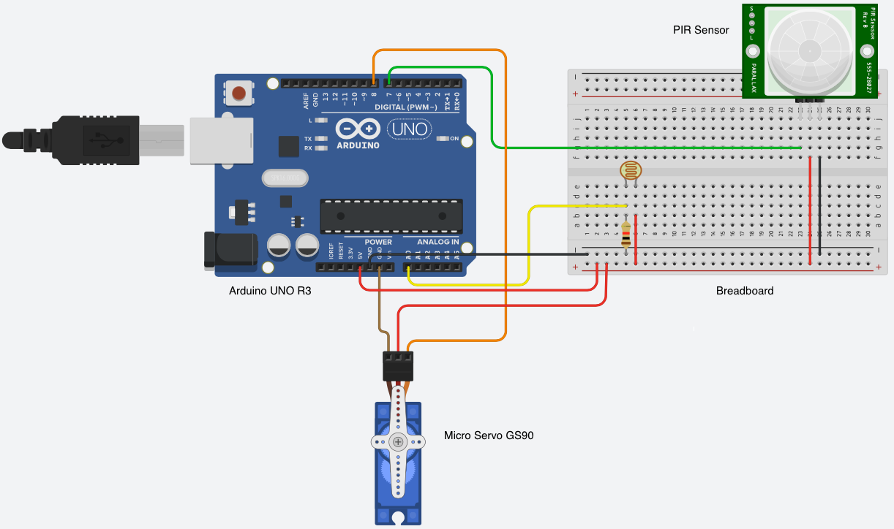

Overview
> A motion sensor that will be able to detect if anyone is in the room, and be able to automatically turn a light switch on and off accordingly. This project will involve a Arduino board as controller, a PIR sensor for detecting infrared that is emitted by humans, and a servo motor that will directly turn the switch on and off.

Model
